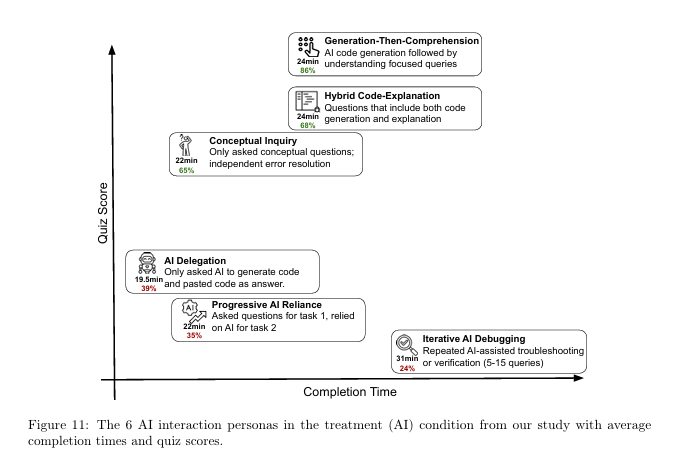
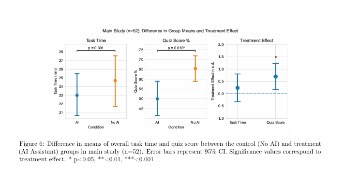

## The Data

- ## 84% of respondents are using AI tools this year
	- According to Stack Overflow's [2025 developer survey](https://survey.stackoverflow.co/2025/ai#sentiment-and-usage-ai-select-ai-select)

#### Quotes

> Among participants who use AI, we find a stark divide in skill formation outcomes between high-scoring interaction patterns (65%-86% quiz score) vs low-scoring interaction patterns (24%-39% quiz score). *The high scorers* only asked AI conceptual questions instead of code generation or *asked for explanations to accompany generated code; these usage patterns demonstrate a high level of cognitive engagement.* [emphasis mine]
> - Shen & Tamkin, [How AI Impacts Skill Formation](https://arxiv.org/pdf/2601.20245)

> Together, our results suggest that the aggressive incorporation of AI into the workplace can have negative impacts on the professional development workers if they do not remain cognitatively [sic] engaged. Given time constraints and organizational pressures, junior developers or other professionals may rely on AI to complete tasks as fast as possible at the cost of real skill development. Furthermore, we found that the biggest difference in test scores is between the debugging questions. This suggests that as companies transition to more AI code writing with human supervision, humans may not possess the necessary skills to validate and debug AI-written code if their skill formation was inhibited by using AI in the first place.
> - Shen & Tamkin, [How AI Impacts Skill Formation](https://arxiv.org/pdf/2601.20245)

#### Results

> In the initial coding phase of our qualitative analysis... we developed a typology of six AI interaction patterns... yielding different outcomes for both completion time and skill formation (i.e. quiz score). (figure 11)
> - Shen & Tamkin, [How AI Impacts Skill Formation](https://arxiv.org/pdf/2601.20245)

	

The group within the optimal intersection of *lowest* Completion Time and *highest* Quiz Score axes: "Generation-Then-Comprehension".
> *High-scoring interaction patterns* were clusters of behaviors where the average quiz score is 65% or higher. *Participants in these clusters used AI both for code generation, conceptual queries or a combination of the two*.
> • Generation-Then-Comprehension (n=2): After their code was generated, they then asked the AI assistant follow-up questions to improve understanding.

> **Figure 6** shows that while using AI to complete our coding task did not significantly improve task completion time, *the level of skill formation gained by completing the task, measured by our quiz, is significantly reduced* (Cohen d=0.738, p=0.01). There is a 4.15 point difference between the means of the treatment and control groups. ***For a 27-point quiz, this translates into a 17% score difference or 2 grade points.*** Controlling for warm-up task time as a covariate, the treatment effect remains significant (Cohen’s d=0.725, p=0.016). [emphasis mine]

	

Generation-Then-Comprehension is exactly what Total-Recall was build for.
