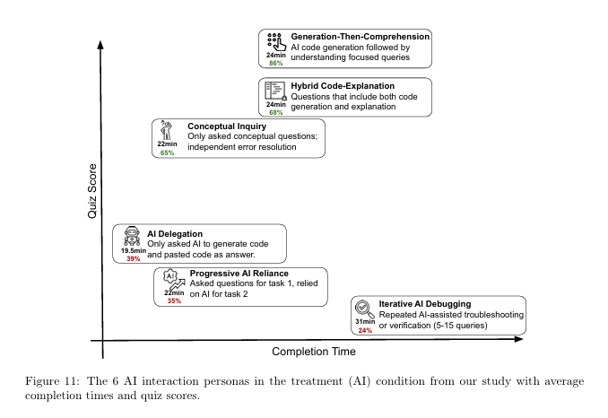
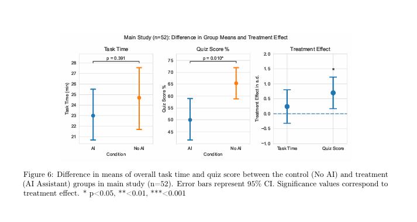

<p align="center">
	
</p>

Preserve engineering intuition in the age of AI agents.

Cognitive retention layer for AI-assisted engineering. Four seconds per Git event is two letter-grades of skill retention saved.

## Problem Statement

Aggressive adoption of AI assisted development tooling has proven to have negative impacts on software engineering skill development *unless engineers stay "cognitively engaged"*.

> 84% of developers are using AI tools this year.
- [Stack Overflow's developer survey 2025](https://survey.stackoverflow.co/2025/ai#sentiment-and-usage-ai-select-ai-select)

> We find that AI use impairs conceptual understanding, code reading, and debugging abilities... For a 27-point quiz, this translates into a 17% score difference or 2 [letter] grade points.
- [How AI Impacts Skill Formation](https://arxiv.org/pdf/2601.20245), arXiv - Cornell University
	- Judy Hanwen Shen, Alex Tamkin

> We found that using AI assistance led to a statistically significant decrease in mastery... AI may accelerate productivity while inhibiting skills formation.
- [How AI assistance impacts the formation of coding skills](https://www.anthropic.com/research/AI-assistance-coding-skills)
	- Anthropic Research Team
## Philosophy
Git is the stable substrate.

That is where we anchor.

We should never feel like "work after the work".

We should feel like "a 4-second mental rep".
## Key Features
- [ ] 1.0 Fast and Interruptible
	- [ ] 1.1 Optional Strict Mode
- [ ] 2.0 Difficulty Configurable
	- [ ] 2.1 Adaptive Recall Difficulty
- [ ] 3.0 Feels Invisible
	- [ ] 3.1 Async/Cache Layers
- [ ] 4.0 Gamification/Hosted Leaderboard
	- [ ] 4.1 see -> 1.0.3
	- [ ] 4.2 "Recall Debt"
- [ ] 5.0 Concept Fingerprinting
	- [ ] 5.1. Long-term Adaptive Curricula
---
## Setup

```sh
# Go
go install github.com/colinwilliams91/total-recall@latest
```

**1. Initialize user config and preferences:**

```sh
total-recall init
```

This creates `~/.tr/config.yaml` (your personal config, never committed) and prompts
you about enabling conversation analysis.

**2. Start the daemon:**

```sh
total-recall serve
```

The daemon runs on `localhost:7331` and must be running for hooks and MCP to function.

**3. Initialize a repo (adds `.tr.yaml`):**

```sh
total-recall init  # inside the repo
```

---

## Configuration

Total Recall uses two config files with clear separation of concerns:

### User Config — `~/.tr/config.yaml`
Personal defaults, privacy choices, and AI credentials. **Never committed.**

```yaml
privacy:
  conversation_analysis: false  # opt-in: enabled during `total-recall init`

ai:
  provider: anthropic
  model: claude-sonnet
  api-key: env:ANTHROPIC_API_KEY  # always use env:<VAR> — never paste raw keys

recall:
  difficulty: adaptive
  max_questions: 1
```

### Per-Repo Config — `.tr.yaml`
Project-specific settings. **Safe to commit.**

```yaml
hooks:
  pre-commit: true
  commit-msg: false
  pre-push: false

mode:
  blocking: false

presentation:
  terminal: true
  mcp: false

# Optional: override user recall defaults for this repo only
recall:
  max_questions: 3
```

> **Note:** `privacy.*` and `ai.*` in `.tr.yaml` are discarded with a warning.
> Credentials and privacy choices are always user-level.

### Inspect the resolved config

```sh
total-recall config --show
```

Prints every key annotated with its source (`user` / `repo` / `default`).

See [CONFIG.md](DOCS/ARCHITECTURE/CONFIG.md) for full deep-merge rules.
## Data

- ## 84% of respondents are using AI tools this year
	- According to Stack Overflow's [2025 developer survey](https://survey.stackoverflow.co/2025/ai#sentiment-and-usage-ai-select-ai-select)

#### Quotes

> Among participants who use AI, we find a stark divide in skill formation outcomes between high-scoring interaction patterns (65%-86% quiz score) vs low-scoring interaction patterns (24%-39% quiz score). *The high scorers* only asked AI conceptual questions instead of code generation or *asked for explanations to accompany generated code; these usage patterns demonstrate a high level of cognitive engagement.* [emphasis mine]
> - Shen & Tamkin, [How AI Impacts Skill Formation](https://arxiv.org/pdf/2601.20245)

> Together, our results suggest that the aggressive incorporation of AI into the workplace can have negative impacts on the professional development workers if they do not remain cognitatively [sic] engaged. Given time constraints and organizational pressures, junior developers or other professionals may rely on AI to complete tasks as fast as possible at the cost of real skill development. Furthermore, we found that the biggest difference in test scores is between the debugging questions. This suggests that as companies transition to more AI code writing with human supervision, humans may not possess the necessary skills to validate and debug AI-written code if their skill formation was inhibited by using AI in the first place.
> - Shen & Tamkin, [How AI Impacts Skill Formation](https://arxiv.org/pdf/2601.20245)
#### Results

> In the initial coding phase of our qualitative analysis... we developed a typology of six AI interaction patterns... yielding different outcomes for both completion time and skill formation (i.e. quiz score). (figure 11)
> - Shen & Tamkin, [How AI Impacts Skill Formation](https://arxiv.org/pdf/2601.20245)



The group with in optimal intersection of *lowest* Completion Time and *highest* Quiz Score axes "Generation-Then-Comprehension".
> *High-scoring interaction patterns* were clusters of behaviors where the average quiz score is 65% or higher. *Participants in these clusters used AI both for code generation, conceptual queries or a combination of the two*.
> • Generation-Then-Comprehension (n=2): After their code was generated, they then asked the AI assistant follow-up questions to improve understanding.

> **Figure 6** shows that while using AI to complete our coding task did not significantly improve task completion time, *the level of skill formation gained by completing the task, measured by our quiz, is significantly reduced* (Cohen d=0.738, p=0.01). There is a 4.15 point difference between the means of the treatment and control groups. ***For a 27-point quiz, this translates into a 17% score difference or 2 grade points.*** Controlling for warm-up task time as a covariate, the treatment effect remains significant (Cohen’s d=0.725, p=0.016). [emphasis mine]



## Contributing

### Build

Using Make:

```sh
make build
```

Produces `total-recall.exe` (Windows) or `bin/total-recall` (Linux/macOS).

Or directly with Go:

```sh
go build -o bin/total-recall.exe ./cmd/total-recall
```

Install to your $GOPATH/bin:

```sh
make install
# or
go install ./cmd/total-recall
```

---

### Run

After building:

```sh
./bin/total-recall --help
```

Available subcommands:

| Command   |	Description |
| --------- | ------------- |
| serve     | Start the daemon on localhost:7331    |
| init      | Initialize Total Recall for a project |
| config    | Read/write config values              |
| status    | Show daemon status and active config  |

Example:

```sh
./bin/total-recall serve
```

---

### Test

```sh
make test
# or
go test ./...
```

> Note: No test files exist yet — `go test open-source.` will complete with no tests run. The internal packages under `internal` only contain `doc.go` stubs at this stage.

---

### Other Useful Commands

```sh
make tidy    # go mod tidy — sync dependencies
make lint    # run golangci-lint (must be installed separately)
make clean   # remove the bin/ directory
```
