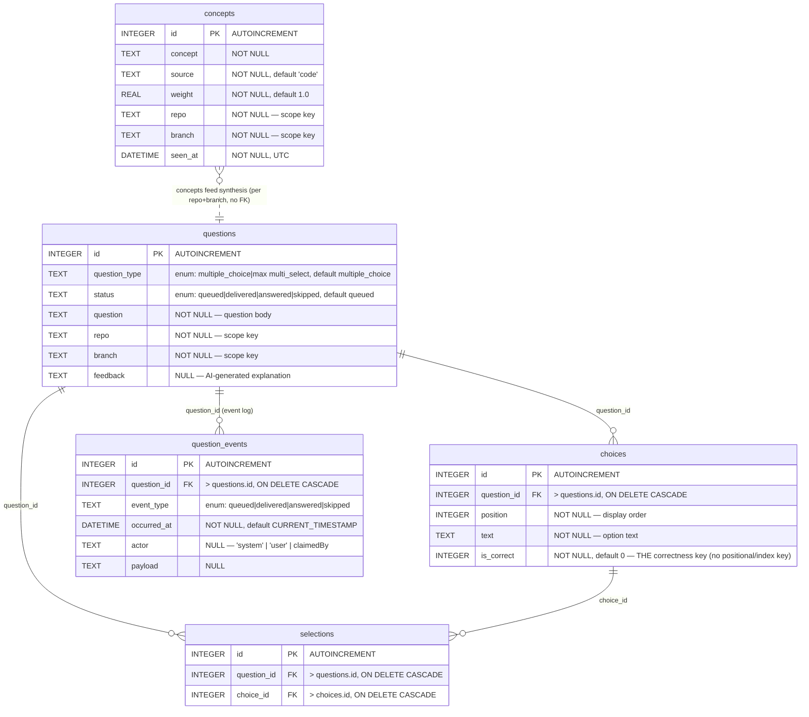
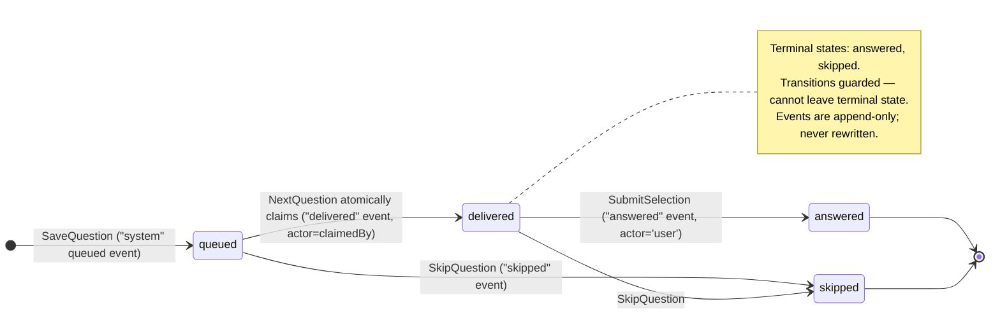
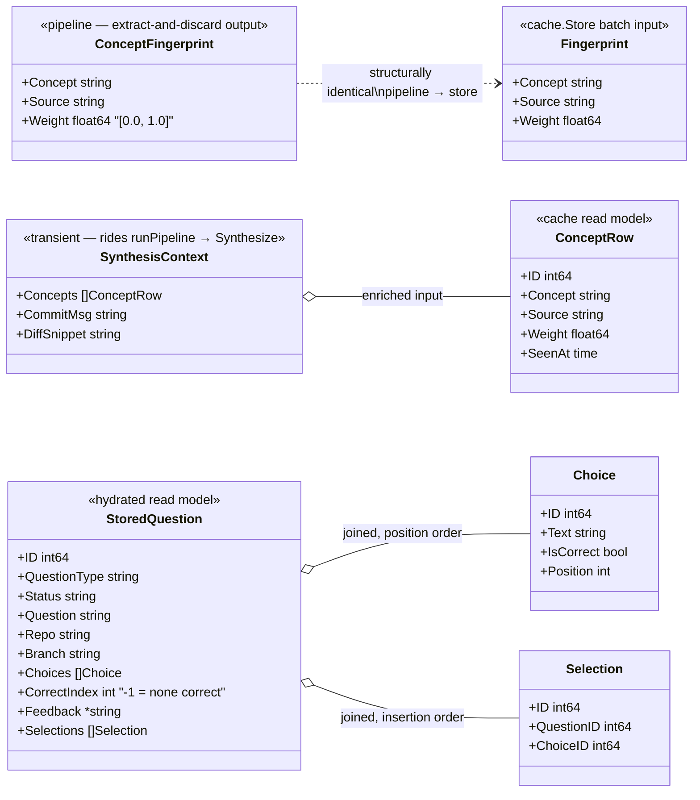
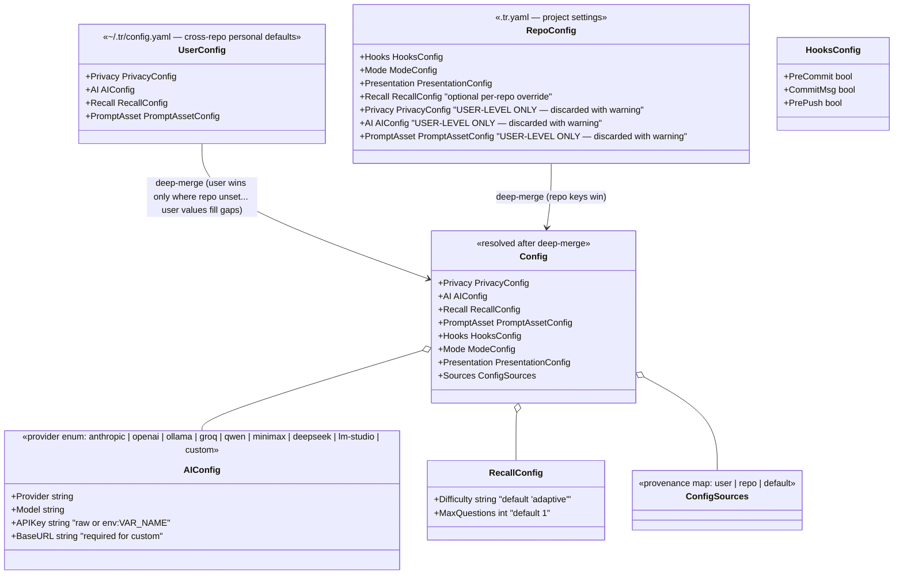

# Total Recall — Data Model

Source of truth: `internal/cache/store.go` (SQLite schema), `internal/config/config.go`, `internal/pipeline/extraction.go`, `internal/recall/engine.go`, `internal/engine/server.go`.

## ERD (persisted state — `~/.tr/memory.db`)



**Notes on relationships:**

- `questions`, `concepts`, and their children are scoped by the `(repo, branch)` pair — no FK, no global pool. Empty repo/branch is refused at the store layer.
- `selections` is an association table; `UNIQUE(question_id, choice_id)` prevents duplicate picks and defensively blocks cross-question choice IDs. It carries **no timestamp** — the parent question's `answered` event is the authoritative "when".
- `is_correct` on `choices` is the sole correctness key. `CorrectIndex` in `StoredQuestion` is derived post-hoc and is a **presentation aid only** (sentinel `-1` = none correct).
- `questions.status` is a denormalized cache of lifecycle state; the **source of truth is the latest `question_events` row**. Queue order is derived from the `queued` event's `occurred_at` (partial index `idx_qe_qid_time WHERE event_type='queued'`).

## Enums & state machine



## In-memory / transient structures (never persisted as-is)



**Flow:** `git diff` → `pipeline.ExtractConcepts` → `ConceptFingerprint`(s) → `Store.Save` as `Fingerprint` → `concepts` rows → `recall.Engine` reads `Recent(repo, branch)` → `SynthesisContext` → AI provider → shuffled `Question` → `Store.SaveQuestion` → `questions` + `choices` + `queued` event.

## Config model (two-tier YAML deep-merge)



## Storage layout

```
~/.tr/ (or $TR_HOME)          ← single data dir, 0700
├── memory.db                 ← SQLite: concepts, questions, choices, selections, question_events
└── config.yaml               ← UserConfig
```

Key invariants:

- `db.SetMaxOpenConns(1)` — single-connection pool serializes all access; `NextQuestion`'s SELECT-then-UPDATE exactly-once claim depends on it.
- No `ALTER TABLE` migration path — schema changes are done by deleting `memory.db` (see `internal/cache/MIGRATION.md`).
- Concepts and questions are always repo+branch-scoped; the store refuses empty scope keys.
