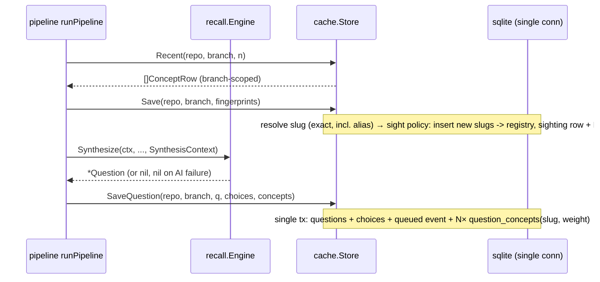
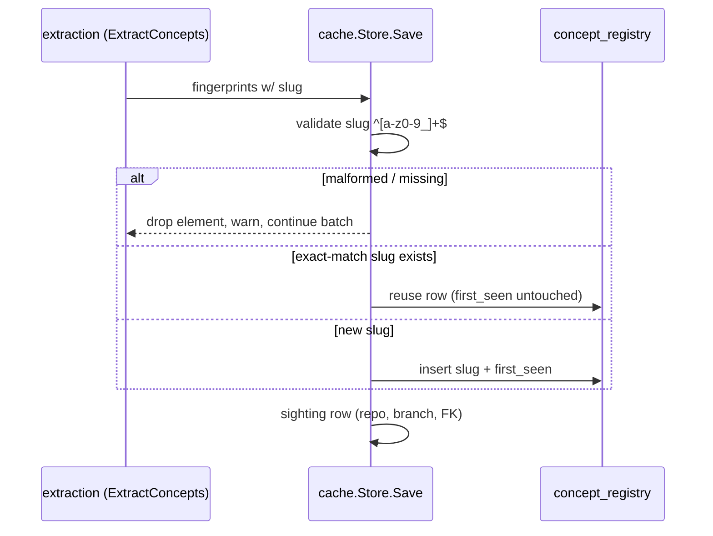

# Design — Concept Provenance

## Context

Today `internal/cache/store.go` owns a five-table schema (`concepts`, `questions`, `choices`, `selections`, `question_events`) in which every row is scoped by `(repo, branch)` — the store refuses empty scope keys, and `concepts` is an append-only fingerprint log where the same idea ("Go interfaces") accumulates many unlinked rows across commits, branches, and repos. Extraction (`internal/pipeline/extraction.go`) produces `ConceptFingerprint{Concept, Source, Weight}` from one AI call per hook event (async, post-202); synthesis (`internal/recall/engine.go`) consumes `SynthesisContext{Concepts, CommitMsg, DiffSnippet}` — built by `runPipeline` from `store.Recent(repo, branch)` — and persists questions atomically via `SaveQuestion`. Nothing records which concepts fed a question; outcomes (`selections` + `choices.is_correct` + `question_events`) grade questions but not concepts.

Constraints that shape this design: no in-code migration path (`CREATE TABLE IF NOT EXISTS` only; manual `memory.db` teardown per `internal/cache/MIGRATION.md` — schema changes are currently free of user-facing pain at pre-production); `db.SetMaxOpenConns(1)` serializes all access; the hook response path must never wait on AI or store work; `modernc.org/sqlite`, no CGo. Motivation in `proposal.md` (# Why). Behavior contracts in the four delta specs.

## Goals / Non-Goals

**Goals:**
- Two-layer model: user-scoped identity (`concept_registry`) + repo/branch-scoped raw observations (`concepts` sightings gain an FK, rest unchanged).
- Slug identity minted inside the existing extraction AI call — one contract field, no second call, no latency at the hook.
- Provenance: `question_concepts` rows written in the same transaction as the question, sourced from engine inputs (`SynthesisContext`), not from the AI.
- Deterministic identity semantics everywhere: exact match after canonicalization, aliases as an exact lookup, loud rejection of malformed slugs.
- Working-surface-first priority preserved at the store layer (feed stays `Recent(repo, branch)`; identity/mastery may only refine ordering *within* the feed).

**Non-Goals:**
- Mastery model (`concept_mastery` table or derived aggregation queries) — this change builds the inputs; no consumer reads them yet. First history-aware resolver (`Performance`/`SpacedRepetition`, per `adaptive-difficulty`'s Non-Goals) will consume `question_concepts` + outcomes via joins; a denormalized mastery projection is a later decision.
- Fuzzy matching, similarity search, or an AI-merge pass for identity — rejected for good (determinism, N² cost, no testability). Aliases are the pressure valve.
- `multi_select` / correctness-grading work — owns nothing in the answer-flow; tracked separately (baggage item).
- Observational audit of resolved difficulty + used concepts into `question_events.payload` — sequenced after the `adaptive-difficulty` change lands and the resolver writes a difficulty we can actually audit.
- Cross-device sync, multi-tenant anything — single-user store is a premise, not a decision here.

## Decisions

### Decision: Two tables, two scopes — not one table with ignored columns

```sql
CREATE TABLE IF NOT EXISTS concept_registry (
  slug       TEXT PRIMARY KEY,              -- [a-z0-9_]+, enforced at write boundary
  prose      TEXT NOT NULL,                 -- first-seen human fingerprint (AI's `concept` text)
  first_seen DATETIME NOT NULL
);

CREATE TABLE IF NOT EXISTS concepts (       -- sightings: scope stays (repo, branch)
  id        INTEGER PRIMARY KEY AUTOINCREMENT,
  slug      TEXT NOT NULL REFERENCES concept_registry(slug),
  prose     TEXT NOT NULL,
  source    TEXT NOT NULL DEFAULT 'code',
  weight    REAL NOT NULL DEFAULT 1.0,
  repo      TEXT NOT NULL,
  branch    TEXT NOT NULL,
  seen_at   DATETIME NOT NULL
);
```

The registry is deliberately minimal: no repo/branch columns at all. A registry row means "this user knows about this concept" — sightings are where scoping lives. Scope-refusal behavior stays exactly as-is for `Save`, `Recent`, et al. (extended to refuse empty repo/branch *before* any registry write, so scope failure never mints an identity).

**Alternatives considered:**
- *One `concepts` table carrying `repo`/`branch` columns that identity queries ignore.* Rejected: schema lies about its own semantics; the enforced no-global-pool invariant must be special-cased for that table, carving a hole in the rule that prevents the empty-scope bug class; and nothing is gained — both layers need different constraints, so a shared shape helps neither. (Detail: this was explicitly considered and ruled out in explore — the shape *is* the semantics.)
- *Slug column on `questions`… * Not a real alternative (provenance is many-to-many).

### Decision: Slug minted by the AI in the extraction call, validated at the write boundary

`ConceptFingerprint` gains `Slug string`; the extraction prompt instructs slug emission (`"slug": "go_interfaces"`). `Store.Save` accepts only `[a-z0-9_]+`; anything else drops the *element* with a logged warning and saves the rest of the batch. The choice of validation at the **store** (not just at parse time in `ExtractConcepts`) is deliberate defense-in-depth: extraction parse errors already degrade gracefully (empty slice + log), and slugs malformed upstream then corrected downstream are a bug class we want observable *once* at the seam that owns identity.

**Alternatives considered:**
- *AI-merge pass / embedding similarity at extraction or read time.* Rejected: non-deterministic across providers and model versions; locally branchless "same concept" would silently fragment anyway, and a global fuzzy match needs per-provider consistency across 10+ adapters.
- *Deriving slugs from prose mechanically at write time (client-side normalize of `concept`).* Rejected as the primary mint: the AI has the context to pick a *general name* ("interface dispatch and dispatch tables" → `go_interfaces`); a client lexer can only lowercase words — every variant phrase becomes a distinct identity, worst of both worlds.
- *Mint slug at registry insert from prose after the fact.* Rejected: post-hoc renaming means identity churn on already-written provenance rows.

### Decision: Provenance is engine-derived and written in the `SaveQuestion` transaction

`question_concepts(question_id, slug, weight)` is populated from the batch in `SynthesisContext` — the same list of `ConceptRow`s already in memory at `runPipeline`. No new AI contract, no new provider call. The weight recorded is the sighting's weight *at synthesis time*, freezing the confidence snapshot that drove the question (the registry/sighting rows may move on later; the provenance read doesn't rewrite-watching).





**Alternatives considered:**
- *AI self-tagging (synthesis emits which concepts it used in its JSON contract).* Rejected for v1: contract change on the highest-value call, trust risk on the answer-path parser (contract violations already fail synthesis today — making the *feed identity* ride it would lower resilience). The engine-derived feed is loose (spawned from "what recent batch happened to be loaded"), but capturing it is free today and upgradable later; the deltas `concept-extraction` + `concept-identity` don't hinge on it.
- *Deferred capture into `question_events.payload` JSON.* Explicitly rejected for this change's primary record (unqueryable for mastery joins); **not rejected as a cheap observational side-channel** — parked until after `adaptive-difficulty` lands, per the proposal's sequencing note.

### Decision: Aliases resolve in the store; the CLI surface is a deliberately-late small task

The table (`concept_aliases(alias, target)`) ships with resolution (`Save` resolves alias→target on write) and validation (target must exist; alias must be slug-shaped) — behavior per `concept-identity`. The authoring surface is decided: **`torec alias add|list|remove` as a thin HTTP client to a small daemon route**, deliberately ordered late in the task list, not as a headline.

Grounding that decided it: the daemon owns the SQLite handle (every state-touching command is a thin HTTP client; no other command opens `memory.db`), two-process SQLite writes would violate the single-writer posture, and the command mirrors the house thin-client pattern (`asset`, `config`). TUI authoring rejected outright — no interaction context where it earns its complexity. Pipeline-surfaced suggestions stay parked: they need observed drift data (registry density, colliding pairs in logs) before the false-merge guardrails can be designed honestly.

The value framing for the surface: aliasing is a *repair tool*, not a workflow — the user's only moment of contact is spotting a split concept in a listing (`go_interfaces` asked 6x + `golang_interfaces` asked 2x → one command merges them going forward). Low frequency by design; cheap insurance, therefore a small late task rather than a headline feature.

### Decision: All store-level changes in one PR-bounded schema reshape

Because `CREATE TABLE IF NOT EXISTS` makes `Open()` a no-op against a stale schema, this change ships as a single bounded pass: new tables (`concept_registry`, `concept_aliases`, `question_concepts`), one `ALTER`-free reshape of `concepts` (`slug` FK), `MIGRATION.md` updated. Rollback is a `memory.db` delete; forward-only per house convention.

## Risks / Trade-offs

- **[Risk] AI churns out inconsistent slugs on adjacent commits** (`go_interfaces` vs `golang_interfaces` vs `interval_merging`). → *Mitigation:* prompt contract explicitly instructs stable short/general names; batch-level slug collisions are visible at the write boundary with loud warnings; and aliases are the *human-supplied* cleanup when drift is real. Quality is observable via `concept_registry.first_seen` density.
- **[Trade-off] Provenance is *loose* — it records "synthesized from this recent feed," not "this question is about exactly these concepts."** → *Mitigation:* decision above; it costs nothing today and the eventual tightening (synthesis self-tagging) is a delta `concept-extraction`-like contract change, isolated.
- **[Risk] `Save` visibility: batch behavior changed for slugs — malformed data now drops 1 element instead of the batch.** → *Mitigation:* same graceful-degradation envelope the extraction contract already has (element-level skip + warning), so the pipeline failure-mode doesn't change shape.
- **[Risk] `weight` snapshot semantics can confuse future consumers ("is this the current mastery weight?").** → *Mitigation:* documented in the store schema comment — `question_concepts.weight` is per-write snapshot; recent sighting weight lives in `concepts.weight`.
- **[Trade-off] `Close()`/`Open()` don't see alias writes relayed if the user hand-edits the DB via foreign tooling.** → *Mitigation:* non-goal; alias authoring surface (CLI/daemon command) is the intended writer and will go through `Store`, where validation lives.

## Migration Plan

1. Land schema reshape + registry/alias/provenance tables, `concepts.slug` FK, transactional `SaveQuestion` provenance.
2. Update extraction prompt contract (`assets/prompts/` + inline fallback template) for the `slug` field.
3. Update `MIGRATION.md`: stale-schema users delete `~/.tr/memory.db` (or `$TR_HOME/memory.db`) — documented, one-liner, per existing convention.
4. Update `AGENTS.md` cache table list.
5. Rollback: this is schema + write-envelope + prompt-contract only; reverting the commit restores the prior binary and the prior `memory.db` (no read paths changed for existing consumers). No data migration exists in either direction (deliberate, per pre-production posture).

## Open Questions

- ~~**Alias authoring surface**~~ — resolved in the Decisions section: `torec alias add|list|remove` thin client, deliberately late ordering in tasks.
- **Provenance for skipped/failed synthesis attempts:** should failed synthesis attempts (AI returned garbage) also log the fed concepts somewhere (e.g., `question_events` on no question row)? Cheap to add, but no reader today; defaulting to *no*.
- **Exact alias-collision semantics at mint time:** when an AI slug collides with an existing alias (AI mints slug `joining_tables_in_sql`, alias exists pointing it to `sql_joins`), spec behavior is "lands on the target." Implementation detail (resolve-before-insert vs. insert-then-redirect is implementation-level); flagged only so it lands as a test case, not an afterthought.
